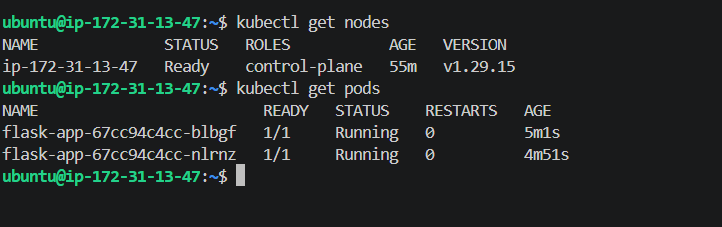
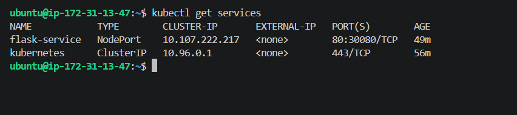
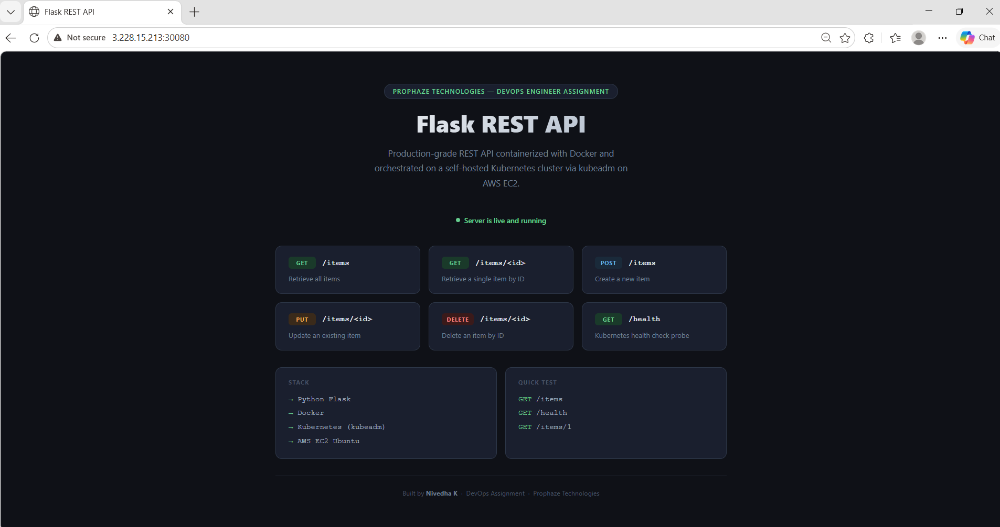
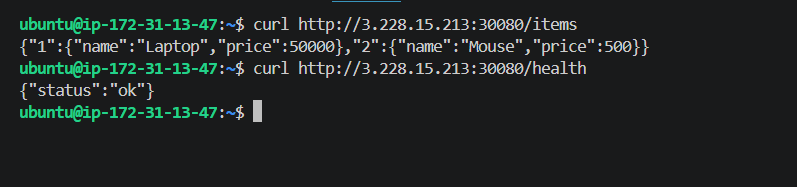

# Flask REST API — Kubernetes Deployment

---

## What is this project?

A production-style REST API built with Python Flask, containerized using Docker, and deployed on a self-hosted Kubernetes cluster set up manually with kubeadm on AWS EC2.

---

## Tech Stack

- **Python Flask** — REST API backend
- **Docker** — containerizes the application
- **DockerHub** — stores and distributes the Docker image
- **Kubernetes via kubeadm** — orchestrates and manages containers
- **AWS EC2 Ubuntu 24.04** — the cloud server hosting the cluster

---

## API Endpoints

| Method | Endpoint | Description |
|--------|----------|-------------|
| GET | / | Home page |
| GET | /items | Get all items |
| GET | /items/\<id\> | Get a single item |
| POST | /items | Create a new item |
| PUT | /items/\<id\> | Update an item |
| DELETE | /items/\<id\> | Delete an item |
| GET | /health | Kubernetes health check |

---

## Project Structure

flask-k8s-app/
├── app.py                           Flask REST API source code
├── requirements.txt                 Python dependencies
├── Dockerfile                       Container build instructions
├── k8s/
│   ├── deployment.yaml              Kubernetes Deployment (2 replicas)
│   └── service.yaml                 Kubernetes NodePort Service (port 30080)
├── screenshots/
│   ├── pods.png                     kubectl get pods output
│   ├── services.png                 kubectl get services output
│   ├── app.png                      Flask app running in browser
│   └── curl.png                     API response from terminal using curl
└── README.md

---

## How I Built This

**Step 1 — Wrote the Flask App**

Built a REST API in app.py with full CRUD — GET, POST, PUT, DELETE routes plus a health check endpoint. Tested locally at http://localhost:5000.

**Step 2 — Dockerized the App**

Wrote a Dockerfile to package the app into a portable container image and pushed it to DockerHub.

    docker build -t nivedha16/flask-k8s-app:v1 .
    docker push nivedha16/flask-k8s-app:v1

**Step 3 — Launched AWS EC2 Server**

Launched an Ubuntu 24.04 t2.medium instance on AWS with the following ports open in the Security Group: 22 (SSH), 6443 (Kubernetes API), 10250 (Kubelet), 30080 (Flask app). Connected via SSH using a .pem key pair.

**Step 4 — Installed Kubernetes on EC2**

Installed containerd as the container runtime, then installed kubeadm, kubelet, and kubectl. Initialized the cluster:

    sudo kubeadm init --pod-network-cidr=10.244.0.0/16

Installed Flannel for pod networking. Removed the control-plane taint so pods can run on the single node.

**Step 5 — Deployed the App**

Transferred the Kubernetes YAML files to EC2 and applied them:

    kubectl apply -f deployment.yaml
    kubectl apply -f service.yaml

**Step 6 — Verified Deployment**

    kubectl get pods
    kubectl get services

Both pods running with STATUS = Running 

---

## Accessing the App

Browser:

    http://3.228.15.213:30080

curl commands:

    curl http://3.228.15.213:30080
    curl http://3.228.15.213:30080/items
    curl http://3.228.15.213:30080/health

---

## Security

- SSH login uses RSA key pair (.pem file) — password login is disabled
- Security Group restricts access to only the required ports
- No hardcoded secrets in the codebase

---

## Screenshots

**kubectl get pods**

**kubectl get services**

**App running in browser**

**API response from terminal using curl**

---

*Submitted by **Nivedha K** · DevOps Engineer Position · Prophaze Technologies*
